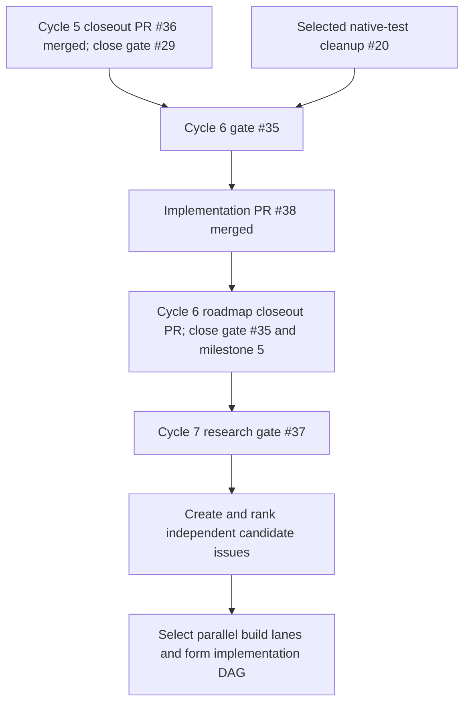
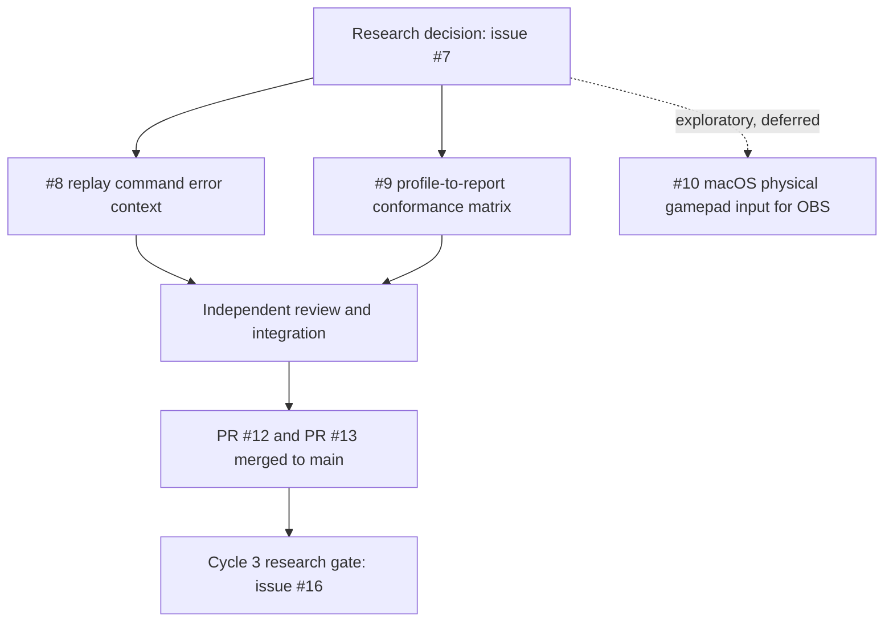
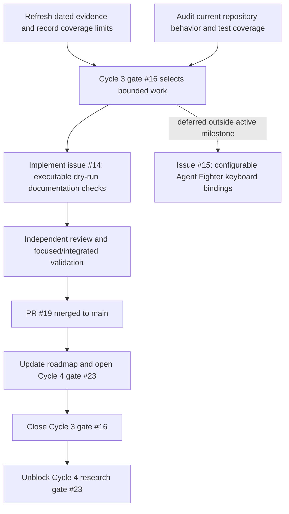
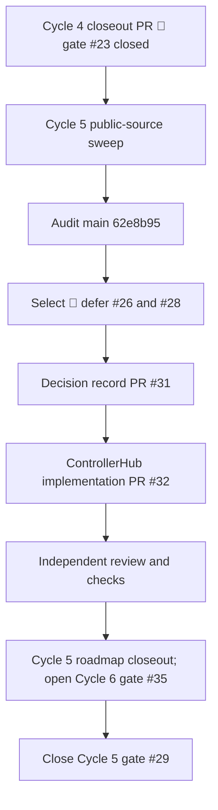
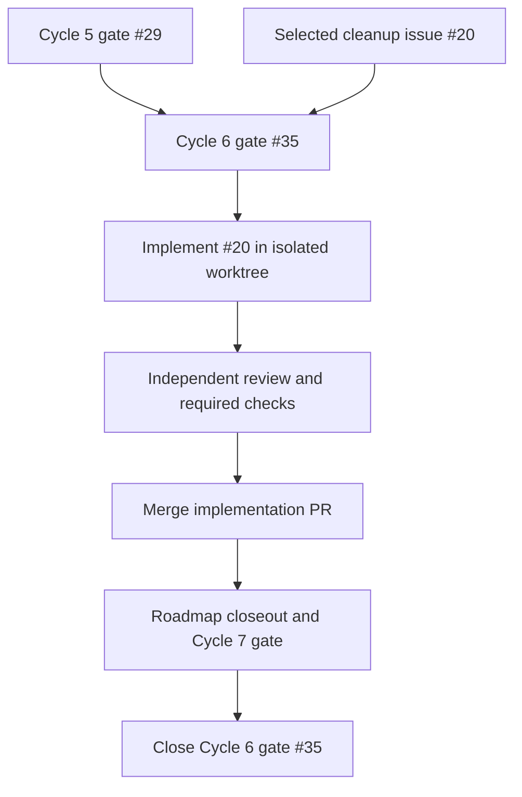

# OpenController AI and Gaming Opportunity Goal

**Status:** Cycle 1 merged in PRs #1–#4. Cycle 2 issues #8 and #9 merged in PRs #12 and #13; #10 remains deferred. Cycle 3 issue #14 merged in PR #19; #15 remains deferred. Cycle 4 issue #22 merged in PR #25; gate #23 closed in PR #30. Cycle 5 issue #27 merged in PR #32; gate #29 closed in PR #36 at `f44fe793ea4fef069c2a187084fcaa536848b336`. Cycle 6 issue #20 merged in PR #38 at `f20aab9ea80be7e01b5337c9000b6322f4a8bb5d`; gate #35 and milestone 5 closed in PR #43. Cycle 7 gate #37 is open in milestone 6; this decision records its source log, selection, and DAG before implementation begins. Selected wave: #39–#42, #45, and #47; #44 and #46 are deferred. Whole-match regression baselines and Reddit/accessibility coverage remain open gaps. GitHub Project V2 creation is blocked by the integration's missing Projects write access; repository milestones, labels, and issue dependencies track the DAG.

## Product goal

Make OpenController dependable when a game or agent needs an OS-visible controller: explain what the host can support, make input failures diagnosable, and let teams reproduce and compare runs. Prioritize native-device readiness and repeatable headless/replay workflows. Keep driver installation, game perception, and game-specific high-level APIs outside the SDK's first delivery.

The goal is grounded in both the repository roadmap and a targeted public-source sweep. The evidence supports concrete compatibility and evaluation friction; it does not establish market-wide prevalence.

## Evidence boundary

### Verified in this repository

| Observation | Source | What it supports |
| --- | --- | --- |
| Signed, installable native device flows and physical host feedback are the next milestone. | [README.md](../../README.md#L150) | Native setup is a first-party product gap. It does not establish how many users are blocked by it. |
| Native setup emits reviewed assets and commands but does not install, sign, change permissions, or activate system extensions. | [native-host-bridge.md](../native-host-bridge.md#L71) | Setup automation has a clear safety boundary. |
| The roadmap calls for stored Agent Fighter regression baselines. | [README.md](../../README.md#L864) | Headless regression work is already in project scope. |
| The roadmap calls for JSON, CSV, and training-friendly replay export. | [README.md](../../README.md#L865) | Replay export is already in project scope. |
| The CLI replay command reports a summary; replay logs already store event streams. | [replay-logs.md](../replay-logs.md#L1) | There is an existing implementation path for practical replay inspection/export. |
| Agent Fighter has a headless match-series runner and quality gates. | [agent-fighter.md](../agent-fighter.md) | Existing evaluation code can support a baseline workflow. |

### External research state

The targeted sweep ran on 2026-10-04 across SDL and Steam for Linux GitHub issues, Steam Community discussions, Factorio Learning Environment reports, Hacker News, and the OpenAI developer forum. It found repeated examples of device-specific mapping/initialization failures, host permission or virtual-device lifecycle friction, and hard-to-reproduce agent-evaluation errors. Treat these as recurring categories in the reviewed sources, not prevalence estimates.

Coverage is incomplete. Reddit endpoints return an HTTP 403 network-security page, so no Reddit posts were reviewed. GamingOnLinux search returned the homepage without results; its latest RSS feed had no relevant controller/gamepad/Steam Input items. Search results were targeted samples, not an exhaustive read of every forum, repository, or historical thread. Thread replies/reactions measure attention to that report, not affected-user counts.

#### Source log

| Source and date | Direct evidence | Observed pain and evidence limits |
| --- | --- | --- |
| SDL issue #16441, 2026-10-04 | [8BitDo Ultimate 2C rejected over Bluetooth](https://github.com/libsdl-org/SDL/issues/16441), 0 comments when checked | A Bluetooth PID not recognized by SDL's 8BitDo driver prevents this device mode from initializing. The report requests the missing PID mapping; no other workaround or recurrence is shown. |
| SDL issue #16434, 2026-10-03 | [GameSir T3s calibration reply length](https://github.com/libsdl-org/SDL/issues/16434), 0 comments | Switch-mode controller is detected on Linux but fails HIDAPI initialization because the calibration reply has a different length. No workaround is stated; this is a specific protocol case. |
| SDL issue #16400, 2026-09-28 | [Steam Controller remains in lizard mode](https://github.com/libsdl-org/SDL/issues/16400), 0 comments | Keyboard/mouse fallback and gamepad events conflict; the report asks SDL to disable the fallback. No workaround is shown. |
| SDL issue #16237, 2026-09-03 | [Betop motion data is NaN in SDL3](https://github.com/libsdl-org/SDL/issues/16237), 4 comments | Buttons/rumble work while gyro/accelerometer data is unusable; the report compares SDL versions and Switch behavior, with no workaround stated. |
| SDL issue #15658, 2026-05-20 | [8BitDo triggers lack analog input](https://github.com/libsdl-org/SDL/issues/15658), 7 comments | SDL/Steam expose non-analog triggers where a browser gamepad tester reports values. Shows API/backend differences for a particular controller, not all devices. |
| Steam for Linux issue #10442, 2024-01-28 | [Wayland asks to allow remote interaction](https://github.com/ValveSoftware/steam-for-linux/issues/10442), 130 comments, 118 reactions | Fedora/GNOME Wayland consent blocks using an Xbox controller as a mouse. The issue suggests granting the portal prompt or using X11. High engagement is not a rate estimate. |
| Steam for Linux issue #13665, 2026-09-29 | [Game Mode recreation silently drops controller input](https://github.com/ValveSoftware/steam-for-linux/issues/13665), 0 comments | Launching an app can recreate Steam Input's virtual gamepad and leave other running apps without input. Recent singleton report; no workaround is stated. |
| Steam for Linux issue #13029, 2026-03-23 | [ASUS HID events reset the Steam virtual gamepad](https://github.com/ValveSoftware/steam-for-linux/issues/13029), 4 comments | Reporter observes input reset across several games after an unrelated device event; one reporter, several affected titles, no documented fix. |
| Sunshine issue #3527, 2025-01-10 (closed 2025-07-29) | [Transition away from ViGEmBus](https://github.com/LizardByte/Sunshine/issues/3527), 10 comments; [WinUHid backend proposal #4948](https://github.com/LizardByte/Sunshine/pull/4948), opened and closed unmerged 2026-04-04 | A Windows streaming user reported Sunshine failed without the legacy ViGEmBus driver and raised concerns about its maintenance. Maintainers said the driver remained required; comments discuss code-signing constraints. A WinUHid alternative was proposed in a PR but closed unmerged. Historical single-project report, not evidence of a current OpenController blocker. |
| Steam Deck discussion, 2026-08-04 | [GameSir G7 Pro rumble missing on SteamOS](https://steamcommunity.com/app/1675200/discussions/1/580552797772062608/), 2 replies | Dongle input works but rumble is lost; switching controller modes did not help, and one commenter reports the same symptom. |
| Steam Deck discussion, 2026-09-26 | [Controller order breaks while docked](https://steamcommunity.com/app/1675200/discussions/1/806848045381749056/), 10 replies | Docked Legion Go S with two Xbox pads reports unusable controller ordering; the author forced a restart but still could not play. One thread, not prevalence data. |
| Steam Deck feature request, 2026-09-30 | [Expose Steam Deck as a Bluetooth controller](https://steamcommunity.com/app/1675200/discussions/2/585061535403037013/), 0 replies | One request for a virtual-controller mode that cites a community project as today's workaround. Low-confidence demand signal. |
| Factorio Learning Environment issue #417, 2026-09-14 | [Client-join blockers and install papercuts](https://github.com/JackHopkins/factorio-learning-environment/issues/417), 1 comment | Agent-evaluation user reports dependency and client-join failures, swallowed errors, and camera/event-handler problems; local patches were the workaround. Strong report detail, one environment. |
| Factorio Learning Environment issue #418, 2026-09-15 | [Agent docs: four code examples cannot run](https://github.com/JackHopkins/factorio-learning-environment/issues/418), 0 comments | Several documented examples fail against a live headless server. The report proposes correcting signatures/docs but gives no working workaround. Single project report, not controller transport specifically. |
| Factorio Learning Environment PR #413, 2026-09-07 | [Retry and error handling for transient observations](https://github.com/JackHopkins/factorio-learning-environment/pull/413), 0 comments | A long evaluation rollout failed on a transient observation error; the underlying cause was hidden and healthy epochs were cancelled. Replaying the same actions succeeded twice; retry/backoff and logging the underlying exception were the fix. This is a merged fix PR, not an open request. |
| OpenAI developer forum, 2026-02-16 | [2D game built with Codex and agent skills](https://community.openai.com/t/show-2d-game-built-using-codex-and-agent-skills-zero-code/1374319), 7 replies | A player could not move with arrows because only WASD was mapped; author added arrow/space mappings. Concrete action-map friction, but a human-player demo rather than an SDK user report. |
| OpenAI developer forum, 2026-09-29 | [Autonomous assistant for PC gamers](https://community.openai.com/t/autonomous-agent-assistant-for-pc-gamers/1402066), 1 reply | One gamer says manual state descriptions and screenshots are cumbersome and asks about temporary controller takeover. Perception/memory interest is outside this SDK's current scope. |
| Hacker News, 2025-03-11 | [Factorio Learning Environment launch](https://news.ycombinator.com/item?id=43331582), 749 points, 209 comments | Strong interest in game-agent benchmarking and long-horizon automation. A launch discussion, not a pain-point survey; the environment exposes high-level game actions rather than a virtual gamepad. |
| Hacker News, 2026-09-11 | [Clawfight agentic game](https://news.ycombinator.com/item?id=49658483), 13 points, 17 comments | Creator says Unreal-based remote control quality was not good enough and describes a near-real-time video approach. The reported quality issue is ambiguous, so fit to controller transport is low. |

#### Cross-source interpretation

| Candidate theme | Evidence and confidence | Product interpretation |
| --- | --- | --- |
| Host permissions, controller identity/mapping, and virtual-device lifecycle | Several distinct SDL and Steam reports across 2024-2026, plus Steam Deck reports. **Moderate confidence** that this is a recurring integration category; prevalence and the fraction OpenController can fix are unknown. | Prioritize clear host/helper readiness output and follow with a compatibility test matrix. SDL or Steam-owned mapping bugs must be fixed upstream. |
| Reproducing failed agent runs and making errors actionable | Three adjacent FLE evaluation reports discuss setup, transient observation failures, hidden errors, and replaying the same sequence. **Moderate confidence** in the workflow friction; one benchmark ecosystem, medium project fit. | Replay export and deterministic baselines are direct, bounded improvements to existing OpenController capabilities. They do not reproduce screenshots or game state the SDK never recorded. |
| Consistent action mapping and broader game control | SDL has device-specific mapping reports; one OpenAI forum game demo needed arrow-key support. **Low-to-moderate confidence**; several examples but different users and layers. | Document normalized action maps and test consumer-visible profiles. Do not claim a universal mapping can repair every title. |
| Screen understanding, memory, and high-level game APIs | One gamer requested these; high-engagement HN game-agent launches use game-domain APIs. Evidence is mixed and mostly adjacent. | Keep perception, model planning, and game-specific integrations optional or out of scope. Many agent environments do not need a controller emulator. |

For each future signal, keep the direct post/issue URL, date, persona and situation, workaround, recurrence indicators, counterexamples, and confidence. Search/result pages alone are not evidence.

## Prioritized opportunity backlog

Rank balances user value, evidence strength, fit to this SDK, implementation cost, and platform/security risk. Confidence describes only the reviewed sources, not market size.

| Rank | Opportunity | User / current workaround | Evidence and confidence | Fit and cost/risk | Decision |
| --- | --- | --- | --- | --- | --- |
| 1 | Native readiness and visible failure diagnosis | Game/agent developers whose host fails to create or retain an OS-visible gamepad piece together OS, Steam Input, and helper logs. | SDL and Steam reports include [Wayland consent](https://github.com/ValveSoftware/steam-for-linux/issues/10442) and [Steam Input recreation](https://github.com/ValveSoftware/steam-for-linux/issues/13665). Moderate category confidence; upstream driver bugs are outside this SDK's control. | High fit; medium cost, with host-specific and privilege risks. | Implement read-only readiness reporting; game-specific consumption proof is deferred. |
| 2 | Replay export and practical inspection | Agent authors debugging a failed run inspect summaries or write their own JSONL parsers. | [FLE's transient rollout failure](https://github.com/JackHopkins/factorio-learning-environment/pull/413) describes hidden errors and an action sequence that succeeds when replayed. Moderate workflow confidence within one benchmark ecosystem. | High fit; medium cost for schema stability and large files. | Implement streaming JSON/CSV export; it cannot restore screenshots or state the SDK did not record. |
| 3 | Deterministic headless regression baselines | Agent authors/CI maintainers want meaningful behavior regressions beyond checking that actions happened. | FLE reports and HN discussion show evaluation interest; OpenController's own Agent Fighter outcome/decision metrics varied substantially across repeated runs. Moderate user-problem evidence, low current implementation confidence. | High roadmap fit; high cost until simulation and telemetry outcomes stabilize. | Defer capture/comparison until a scenario yields stable metrics beyond the existing liveness gate. |
| 4 | Cross-consumer controller compatibility matrix | Integrators swap modes and test each consumer manually to verify axes, rumble, and motion. | SDL reports device-specific issues; Steam Deck discussions report [missing rumble](https://steamcommunity.com/app/1675200/discussions/1/580552797772062608/) and [broken ordering](https://steamcommunity.com/app/1675200/discussions/1/806848045381749056/). Moderate category confidence; many fixes are upstream. | Medium/high fit; medium/high cost for real hardware/OS coverage. | Follow up with a manual matrix and virtual-profile conformance fixtures. |
| 5 | Reconnect, sleep/resume, and input-loss recovery | Desktop/streaming users restart apps or reconnect devices after virtual-device loss. | Recent [Steam Game Mode](https://github.com/ValveSoftware/steam-for-linux/issues/13665) and [uinput reset](https://github.com/ValveSoftware/steam-for-linux/issues/13029) reports, plus [Sunshine's ViGEm transition](https://github.com/LizardByte/Sunshine/issues/3527). Low-to-moderate confidence. | Medium fit; high cost due ownership, crash, and neutral-state semantics. | Defer API changes; first expose and validate lifecycle signals. |
| 6 | Persistent accessible remapping/calibration | Players currently depend on game, Steam Input, or separate host remappers. | One [OpenAI forum demo needed arrow mappings](https://community.openai.com/t/show-2d-game-built-using-codex-and-agent-skills-zero-code/1374319); Reddit accessibility research was blocked. Low confidence and missing target-community coverage. | Medium fit; medium/high research and persistence cost. | Defer until disabled gamers and accessibility communities are researched directly. |
| 7 | Game perception, memory, and provider-neutral gameplay APIs | PC gamers manually share screenshots/state, while benchmarks often use direct game APIs. | One [forum request](https://community.openai.com/t/autonomous-agent-assistant-for-pc-gamers/1402066) contrasts with high-level APIs in FLE and [MCP-first Clawfight](https://news.ycombinator.com/item?id=49658483). Low/mixed fit evidence. | Low/medium fit; high scope expansion into vision and agent orchestration. | Keep outside SDK core; revisit only for an optional integration with stronger evidence. |

## Build goal and acceptance checklist

### Slice A — deterministic headless regression baseline (deferred)

This slice is not in the current implementation stack. Repeated Agent Fighter
runs varied in decision counts (13, 16, 18, and 34), including a failure beyond
a broad 50% tolerance; repeated 95-second attempts still recorded no completed
rounds. A binary per-player activity baseline would duplicate the existing
minimum-decision quality gate. Do not ship a baseline until the harness records
repeatable, meaningful outcomes beyond that check.

Future acceptance criteria:

- [ ] Identify a deterministic game scenario with meaningful, stable metrics
  across repeated captures.
- [ ] Version policy, simulator, runtime, browser, scenario, and run metadata.
- [ ] Compare configuration fields individually and show expected/observed
  values, deltas, and evidence-based tolerances.
- [ ] Keep external-model runs out of deterministic regression gates.
- [ ] Cover passing, failing, malformed, incompatible, and repeated captures.
- [ ] Document metric scope and limitations.

### Slice B — replay export

- [x] Stream JSON arrays and CSV from JSONL without retaining the whole log.
- [x] Keep stable CSV columns, timestamps, and original event JSON so unknown
  fields survive export.
- [x] Report malformed input with the source path and one-based line number.
- [x] Cover mixed events, empty and CRLF logs, quoting, malformed rows, and
  destination aliases that could truncate the input.
- [x] Document supported formats and the preservation contract.

### Slice C — native readiness diagnostics

- [x] Provide a versioned machine-readable report with timestamp, host/runtime,
  backend support, helper path/status/executable state, requirements,
  capabilities, and actionable next steps.
- [x] Distinguish absent, inaccessible, and non-file helper paths; only report
  available for a usable regular file.
- [x] Represent unsupported-host checks as unknown or not applicable, without
  host-specific signing, elevation, or install instructions for another OS.
- [x] Keep diagnostics read-only and document that driver activation and
  game/Steam consumption are not proven by these probes.
- [x] Add OS-shaped tests and document what cannot be validated on this host.
- [x] Treat signed installers as a separate platform-specific follow-up needing
  signing assets and release/security review.

### Discovery and integration

- [x] Audit repository roadmap, existing implementations, and safety boundaries.
- [x] Search selected public AI/gaming sources and record dated links, engagement, workarounds, confidence, and coverage gaps.
- [x] Re-rank the backlog from observed reports, project fit, cost, and risk; defer weakly supported or upstream-owned work.
- [ ] Revisit accessibility and Reddit-specific pain points if those communities become reachable; current feature slices do not depend on this gap.
- [x] Run focused tests/build/format checks for replay export and native readiness on their owned branches.
- [x] Independently review both slices, resolve findings, and review the fixes.
- [x] Run integrated release checks on the combined feature branches.
- [x] Prepare and merge meaningful stacked PRs in dependency order with evidence, acceptance criteria, and exact validation.

### Integrated review and validation

An independent review identified three issues before integration: readiness
could overstate unverified Windows/macOS driver state, Windows elevation/signing
were presented as known requirements, and CSV cells could trigger spreadsheet
formulas. The feature branches were corrected, and the reviewer confirmed all
three findings resolved with no new blockers. A separate review of the Bun,
TypeScript, and package upgrade found no correctness, security, or CI blockers.

After PRs #1–#4 merged, `bun install --frozen-lockfile` and
`bun run release:check` passed on `main`:

- Biome checked 139 files with no fixes needed; `tsc -b` passed.
- 151 tests passed, with 0 failures and 1,000 assertions.
- All 9 Turbo build targets succeeded.
- `bun audit` found no vulnerabilities in 90 packages.
- Package packing passed for all 7 publishable workspace packages.

Windows VHF driver installation/signing and macOS DriverKit activation are
still not probed by the current native doctor, so their readiness remains
`unknown` when those checks cannot be verified.

## Current work DAG

The DAG repeats research, repository audit, bounded selection, implementation,
independent review, required checks, merge, and opening the next research gate.
Earlier cycle DAGs below record historical decisions. Coverage gaps and
whole-match nondeterminism remain explicit; seeded local decisions do not prove
stable match outcomes.

## Branch and PR dependency order

Cycle 1's stack was merged to `main` on 2026-10-04:

- [#1](https://github.com/SYMBaiEX/OpenController/pull/1) toolchain/package upgrade — merged first.
- [#2](https://github.com/SYMBaiEX/OpenController/pull/2) research, ranked goal, and checklist — merged after #1.
- [#3](https://github.com/SYMBaiEX/OpenController/pull/3) replay exporter — rebased on the research branch and merged after #2.
- [#4](https://github.com/SYMBaiEX/OpenController/pull/4) native doctor report — rebased onto the updated `main` after #3 and merged last.

The attempted `feat/fighter-regression-baselines` branch was reset to the DAG
parent and excluded because its measurements were not a trustworthy regression
signal. It remains a deferred backlog item.

## Cycle 2 — research decision and closeout

Research gate [#7](https://github.com/SYMBaiEX/OpenController/issues/7) records the decision for umbrella [#5](https://github.com/SYMBaiEX/OpenController/issues/5). The source log below is a targeted sample of dated reports, not a market survey or prevalence estimate. A zero comment/reaction count is only an engagement snapshot. Evidence identifies debugging and conformance failure modes; it does not establish how often OpenController users encounter them. Reddit still returns HTTP 403, so direct disabled-gamer/accessibility community coverage is missing. Hacker News and general source searches were noisy and launch-oriented; enthusiasm is not counted as pain evidence.

### Cycle 2 source log

| Source and date | Direct evidence | What it supports and limits |
| --- | --- | --- |
| [Factorio Learning Environment (FLE) PR #413](https://github.com/JackHopkins/factorio-learning-environment/pull/413), 2026-09-07 (0 comments, 0 reactions at check time) | A long rollout reported a generic observation error after losing the underlying exception; replaying the same action sequence succeeded twice. The fix retained the exception and logged retry attempts. | Agent-run debugging failure and a concrete logging remedy in one benchmark ecosystem. It does not show prevalence; the error originated outside OpenController's adapter. Candidate [#8](https://github.com/SYMBaiEX/OpenController/issues/8) is limited to context attached to OpenController's own command error events. |
| [FLE issue #417](https://github.com/JackHopkins/factorio-learning-environment/issues/417), 2026-09-14 (1 comment, 0 reactions at check time) | `execute` reports the dead RCON client as not connected while silently returning plausible empty results; a separate status path reports “Connected.” The manual workaround was `instance.rcon_client.connect()`. | A second failure mode in the same ecosystem, not independent ecosystem replication. RCON connection truth is outside this SDK's adapter boundary. |
| [SDL issue #16220](https://github.com/libsdl-org/SDL/issues/16220), 2026-08-31; [SDL issue #14829](https://github.com/libsdl-org/SDL/issues/14829), 2026-01-15; [Steam for Linux issue #13492](https://github.com/ValveSoftware/steam-for-linux/issues/13492), 2026-08-06 | Reports cover incorrect axis-to-trigger mapping for a PDP/Switch-style pad (corrected mapping), a non-Xbox controller example-label mismatch, and DualSense touchpad mapping in MK1 (disabling Steam Input was a workaround; reconnect required a game restart). At check time each report had 0 comments/reactions. | These sit at distinct SDL and Steam layers; the small, low-engagement sample is not prevalence evidence. Candidate [#9](https://github.com/SYMBaiEX/OpenController/issues/9) checks only OpenController's own profile-to-report encoder outputs and documents host limits; it cannot fix SDL/Steam behavior. |
| [DualSense Studio issue #2](https://github.com/SafaElmali/dualsense-studio/issues/2), 2026-09-29 | Chrome detected a Bluetooth DualSense while OBS/CEF Gamepad API did not; restarting, recreating, or interacting with the device did not help. The author explicitly requested an external input bridge. | One unconfirmed report, with no prevalence evidence. OpenController's overlay accepts caller-provided state but does not capture physical gamepads. Candidate [#10](https://github.com/SYMBaiEX/OpenController/issues/10) proposes a macOS-first input source with substantial native API and permission cost. |
| [Steam for Linux issue #13665](https://github.com/ValveSoftware/steam-for-linux/issues/13665), 2026-09-29; [issue #13029](https://github.com/ValveSoftware/steam-for-linux/issues/13029), 2026-03-23 | Reports describe Steam Input virtual-device recreation or reset after host/game lifecycle events. | Lower-fit lifecycle theme: the Linux uinput helper neutralizes on disconnect/stream teardown, but the SDK cannot repair upstream Steam/host lifecycle resets. Retain as deferred evidence, not a Cycle 2 build slice. |

### Ranking and decision

1. **Rank 1: [#8 — replay command error context](https://github.com/SYMBaiEX/OpenController/issues/8).** High repository fit and lower implementation cost. Structured error context can improve the SDK-controlled logging boundary. Evidence is concrete but limited to one benchmark ecosystem, and the slice must not claim to fix upstream observation or RCON errors.
2. **Rank 2: [#9 — profile-to-report conformance matrix](https://github.com/SYMBaiEX/OpenController/issues/9).** High repository fit and preventive value. Evidence is indirect because the observed mapping defects are upstream; the slice asserts correctness of OpenController's own encoder outputs and documents consumer/host limitations. It does not repair SDL or Steam.
3. **Defer as exploratory: [#10 — macOS physical gamepad input for OBS](https://github.com/SYMBaiEX/OpenController/issues/10).** One report motivates exploration, but independent reports and macOS API/permission feasibility are needed before implementation selection.

Lifecycle recovery remains deferred because ownership is largely upstream. Accessibility/remapping remains deferred until direct target-community research is available. Game perception remains outside the SDK's current scope and has weak fit evidence. This targeted sample supports bounded implementation hypotheses; it cannot estimate market prevalence or establish that these are the most common user problems.

**Implementation closeout:** research PR #11 recorded the gate for the two independent feature slices. Issue #8 was implemented and merged by [PR #12](https://github.com/SYMBaiEX/OpenController/pull/12) at merge commit `067fc591fe34e7d09cfdfedcf8db48fcd6a7c0d1`; issue #9 was implemented and merged by [PR #13](https://github.com/SYMBaiEX/OpenController/pull/13) at merge commit `5f7e6fc7054654f220a6cb45a4c438ae0d9e4ae7`. The PRs were merged to `main`; issue #10 remains deferred pending stronger direct evidence and API/permission feasibility review.

Post-merge validation on the combined `main` state: lint checked 140 files; typecheck passed; 162 tests passed with 0 failures and 1,170 assertions; all 9 Turbo build tasks succeeded; audit checked 90 packages with no vulnerabilities; package packing passed for all 7 publishable workspace packages. These checks validate repository behavior and packaging, not SDL/Steam, host/driver, physical-device, or game behavior described in the source evidence.

The Cycle 2 source log remains a targeted sample, not a market survey or prevalence estimate. Its Reddit/accessibility coverage gaps and upstream ownership limits remain in force.

## Cycle 3 — research decision (2026-10-04)

The research and ranking gate in [issue #16](https://github.com/SYMBaiEX/OpenController/issues/16) selected [#14 — keep key SDK documentation examples runnable](https://github.com/SYMBaiEX/OpenController/issues/14) for a bounded, preventive CI-integrity slice, and deferred [#15 — make Agent Fighter keyboard bindings configurable](https://github.com/SYMBaiEX/OpenController/issues/15) outside the active milestone. PR #19 implemented the selected slice and merged it to `main`.

### Refreshed evidence and limits

The dated public reports below informed the gate. They are targeted examples, not a survey or prevalence estimate; reports from another project do not establish a defect or demand in OpenController.

| Source and date | Direct evidence | Interpretation and limits |
| --- | --- | --- |
| [Factorio Learning Environment issue #418](https://github.com/JackHopkins/factorio-learning-environment/issues/418), 2026-09-15 | A reporter said four documented agent API examples failed against a live headless server; no working workaround was recorded. | Concrete documentation failure in another project. It does not show that OpenController examples are stale. It supports checking the validity of examples that this repository owns. |
| [Accessible-Chess issue #5](https://github.com/Oleksii-debug/Accessible-Chess/issues/5), 2026-08-14 | Requests app-owned remappable shortcuts and command aliases, conflict warnings, and keyboard-only recovery/reset. | Accessibility-focused evidence from another product. Its 20 comments include owner status and implementation updates, not 20 independent confirmations; it does not establish Agent Fighter demand. |
| [Hacker News comment #48624304](https://news.ycombinator.com/item?id=48624304), 2026-06-22, discussing an [OpenAssistiveTech article](https://www.openassistivetech.org/how-i-actually-play-video-games-with-sma-the-tools-i-use-every-day/) dated 2026-06-18 | The commenter recounts a friend with a broken arm being banned for third-party keyboard-remapping software while trying to play one-handed. | Indirect single anecdote about third-party remapping policy, not a request for app-owned controls or evidence about Agent Fighter. The article fetch returned HTTP 403; only the comment was reviewed. |
| [OpenAI developer forum demo thread](https://community.openai.com/t/show-2d-game-built-using-codex-and-agent-skills-zero-code/1374319), 2026-02-16 | A player could not move with arrows because that demo mapped only WASD; the author added arrow and space mappings. | One report about a different demo. Agent Fighter already supports arrow-key movement for player two, so this is not evidence of the same defect here. |

Coverage is incomplete: Reddit search and DuckDuckGo returned HTTP 403 on 2026-10-04, and Steam Community search returned a generic page without a useful dated result. The assistive-gaming article also returned HTTP 403. The accessible reports concern other projects or products; no direct accessibility evidence about Agent Fighter was found. The sweep is targeted and cannot estimate prevalence.

### Repository audit and selection

The audit inspected `main` at `ba0529e`, onboarding docs, example entry points, root scripts, and CI. The Getting Started dry-run flow and AI Agent Integration action-map/state-patch snippets are not executed by tests. Root tests cover package suites, not docs snippets or example packages; `examples/basic-dry-run/index.ts` is runnable but has no test or build script. Agent Fighter has a Playwright headless match runner and quality gates, but they do not execute SDK docs or validate keyboard remapping. Player two already has arrow-key movement; `R` resets and `F` toggles fullscreen. The verified gap is missing executable documentation coverage, not a confirmed stale OpenController snippet.

**Selected: #14, preventive CI integrity.** Exercise shared sources for the Getting Started dry-run path, one AI action-map/state-patch path, and the basic dry-run example. Assert observable state, action, or replay behavior. The slice should need no API key, device, OS permission, or live game; it should not claim to verify native, OBS, game, or hardware behavior. Estimated effort is low to medium (1–2 days).

**Deferred: #15.** The accessibility evidence supports remapping as a concern in other products but does not identify an Agent Fighter problem, and its second player already supports arrows. A configurable UI also requires persistence, conflict handling, recovery, and browser testing (estimated 2–4 days), while browser/OS shortcut detection is incomplete. Revisit if stronger direct fit or evidence emerges.

### Cycle 3 implementation closeout (2026-10-04)

PR [#19](https://github.com/SYMBaiEX/OpenController/pull/19) merged as merge commit `f2baa6b297f05c20b065baab196cce8d6a725bdc`; GitHub closed issue #14. The Getting Started dry-run and AI action-map docs now link to the same runnable TypeScript sources that CI executes. The check also covers the basic dry-run example, observable state and replay intents, neutralization, and disconnect. A dedicated TypeScript project brings all of these examples into the root `tsc -b` check. Default replay output uses a unique directory per run.

An independent review caught the fixed-directory replay append issue and the missing TypeScript project coverage before merge; both were corrected. The final review found no blocker. The automated coverage validates the SDK dry-run path only; it does not validate native drivers, OBS, physical hardware, operating systems, Steam, or game behavior.

Integrated validation on `main` after the merge passed: Biome checked 144 files; TypeScript project build passed; 162 tests passed with 0 failures and 1,170 assertions; all 9 Turbo build targets succeeded; audit found no vulnerabilities in 90 packages; package packing passed for all 7 publishable packages; `check:dry-run-examples` passed; and `git diff --check` passed. Issue #15 remains deferred.

### Cycle 4 closeout and Cycle 5 research gate

Cycle 4 research gate [#23](https://github.com/SYMBaiEX/OpenController/issues/23) selected [#22 — seed Agent Fighter local decisions](https://github.com/SYMBaiEX/OpenController/issues/22). The issue's code audit found unseeded `Math.random()` branches in the local policy and no runner seed input or output metadata. Adjacent game-agent benchmark requests motivated investigation but do not establish OpenController user prevalence. Candidates [#20](https://github.com/SYMBaiEX/OpenController/issues/20) (native-test failure cleanup) and [#21](https://github.com/SYMBaiEX/OpenController/issues/21) (host/game compatibility evidence) remain deferred; #10 and #15 also remain deferred.

Implementation PR [#25](https://github.com/SYMBaiEX/OpenController/pull/25) merged to `main` at `8eb744cf3167dee9838160ab7364ca6c3bc66e5f`; GitHub closed issue #22. The server now uses per-player `mulberry32-v1` streams only for randomized local-policy choices, and the headless runner accepts `--seed <uint32>` for a server it starts. Telemetry and JSON summaries report the seed and scope when controlled by the runner; external-server runs do not claim an unknown seed. The change makes identical local decisions repeat for the same seed and observation sequence; it does not make browser-driven full matches deterministic and excludes provider responses.

PR #25 passed CI and received an independent gpt-6-luna agent review that found no blocker. GitHub has no substantive review record: Copilot could not review because of its quota limit, and CodeRabbit was still pending at merge. `bun run release:check` passed: 166 tests, zero failures, typecheck, all 9 build tasks, audit with no vulnerabilities, and package checks. A seeded headless smoke run with seed 42 reported matching server and summary metadata and 16 local decisions. The Playwright CDN returned HTTP 403, so the smoke used the existing system Chromium. These checks validate SDK-controlled policy behavior and packaging, not external game, host, or hardware behavior.

Cycle 4 closed after roadmap closeout PR [#30](https://github.com/SYMBaiEX/OpenController/pull/30) merged at `62e8b9569124219cf6c5fb5b5ad824e18de3c901`; gate #23 and milestone 3 are closed. Cycle 5 selected [#27 — fix ControllerHub docs and test logical ID lifecycle](https://github.com/SYMBaiEX/OpenController/issues/27), merged in [PR #32](https://github.com/SYMBaiEX/OpenController/pull/32) at `e6d576987c9085a3377ce0e10791f56ce1994ada`; its research decision is recorded in [PR #31](https://github.com/SYMBaiEX/OpenController/pull/31). Gate [#29](https://github.com/SYMBaiEX/OpenController/issues/29) and milestone 4 closed in PR [#36](https://github.com/SYMBaiEX/OpenController/pull/36) at `f44fe793ea4fef069c2a187084fcaa536848b336`. Cycle 5 candidates [#26](https://github.com/SYMBaiEX/OpenController/issues/26) and [#28](https://github.com/SYMBaiEX/OpenController/issues/28) remain deferred. That closeout opened Cycle 6 gate #35 and selected issue #20.

### Cycle 5 research decision (2026-10-04)

The gate refreshed sources across HN, OpenAI Developer Community, Steam for Linux, Steam Community, and targeted GitHub projects, then audited integrated `main` at `62e8b9569124219cf6c5fb5b5ad824e18de3c901`. The sources below are dated examples, not a survey or prevalence estimate. External host/application reports do not establish an OpenController defect.

| Source and date | Direct observation | Relevance and evidence limit |
| --- | --- | --- |
| [Clash Royale agent builder on HN #46297477](https://news.ycombinator.com/item?id=46297477), 2025-12-17 | Builder reports about 7 seconds for screenshot, vision, decision, and tool cycles; staggered three agents to act every 2–3 seconds and added an automatic opening action to establish tempo. | Timed agents may benefit from reusable low-overhead actions, but the SDK cannot speed model reasoning. One self-reported project. |
| [T-Rex Runner attempt on HN #43963570](https://news.ycombinator.com/item?id=43963570), 2025-05-12 | Author says a Claude/Playwright attempt failed because latency was too high. | One attempt with no timing breakdown; the delay could be model, tool, browser, or input. |
| [OpenAI Community: Pokémon Silver with Computer Use](https://community.openai.com/t/let-chatgpt-play-games-through-computer-use/1401100), 2026-09-26 | User says setup, navigation, repeated dialogue, and simple movement consume Computer Use allowance and asks for a lower-cost control mode. | One product request; no evidence that this transfers to other agents or controller SDKs. |
| [Steam for Linux #13665](https://github.com/ValveSoftware/steam-for-linux/issues/13665), 2026-09-29 | Steam Machine reporter says Steam recreates its virtual pad on app launch, leaving already-running apps with stale handles until restart. | Detailed upstream Steam lifecycle report; outside OpenController ownership. |
| [Steam for Linux #13418](https://github.com/ValveSoftware/steam-for-linux/issues/13418), 2026-07-15 | Steam Deck user says returning from Discord leaves a game without controller input until the game restarts. | One host lifecycle report, not an SDK defect. |
| [Jellyfin Web #8379](https://github.com/jellyfin/jellyfin-web/issues/8379), 2026-08-19 | Two DS4s overwrite a shared gamepad state, making TV navigation erratic. | Application-specific input ownership example. |
| [Cockpit #3088](https://github.com/bluerobotics/cockpit/issues/3088), 2026-09-22 | ROV users ask that a primary joystick retain control when another gamepad connects; current behavior forwards both. | Adjacent non-gaming input-ownership request. |
| [Selkies #431](https://github.com/selkies-project/selkies/issues/431), 2026-09-29; [ROMM #46](https://github.com/romm-streaming/romm-broker/issues/46), 2026-09-17 | Same reporter cross-posted a browser/virtual-slot conflict; reinitializing Game Mode restored input, but reproducibility was uncertain. | Counted as one report, not two; host/browser ownership is upstream. |
| [PortareOS #436](https://github.com/portare-ch/portareos/issues/436), 2026-09-29; [DuelBox-Web #133](https://github.com/swiftSaneGames/DuelBox-Web/issues/133), 2026-08-19; [Chrome proposal #1313](https://github.com/GoogleChrome/modern-web-guidance-src/issues/1313), 2026-08-14 | One hardware report estimates a polling contribution, one project requests input/browser latency measurements, and one browser proposal describes event-driven input. | Sparse adjacent evidence; no OpenController-specific latency failure or adoption proof. |

Reddit, Google search, and SDL Discourse search returned HTTP 403. Steam Community search was reachable but surfaced only older, low-value threads for this decision. HN Algolia and OpenAI Discourse JSON were reachable. The sweep did not find a clear recurring AI-agent-specific controller problem; accessibility-community coverage remains open. Search was targeted rather than exhaustive, and comments/reactions were not used as prevalence measures.

#### Repository audit and ranking

The audit confirmed a direct documentation/API mismatch: `packages/core/README.md` calls `hub.createController`, while the exported `ControllerHub` implements `add`, `get`, `has`, `list`, `states`, and `disconnectAll`. The README's two-controller example therefore does not match the public class. Existing tests cover two dry-run controllers with distinct IDs and profile entries, but omit assertions for independent state, duplicate logical-ID rejection, and reusing an ID after `disconnectAll`. The SDK assigns logical IDs supplied by callers; it does not discover physical devices or own browser/OS slot identity.

| Decision | Candidate | Fit and evidence | Cost and risk |
| --- | --- | --- | --- |
| Selected | [#27 ControllerHub API contract](https://github.com/SYMBaiEX/OpenController/issues/27) | Fixes a concrete first-party example that calls a nonexistent method and adds missing lifecycle tests. Several other projects report controller ownership conflicts, but those reports do not prove prevalence or an OpenController defect. | Low/medium, about 1–2 days. High confidence in the code/docs mismatch; low confidence in prevalence. |
| Deferred | [#26 real-browser hardware routing check](https://github.com/SYMBaiEX/OpenController/issues/26) | A detailed adjacent project QA gap exists, but no reproducible supported host/browser/hardware path was established. | Medium/high effort and manual hardware needs. |
| Deferred | [#28 SDK-boundary input latency](https://github.com/SYMBaiEX/OpenController/issues/28) | Existing latency status is supplied rather than an end-to-end measurement; a safe clock-compatible SDK boundary remains unproven. | Medium effort with clock-domain and overclaim risk. |

**Selected scope:** correct the ControllerHub README example to use the actual public API, typecheck a runnable counterpart, reject sequential and concurrent duplicate caller-assigned IDs, release reservations after failed creation, assert per-controller state isolation, and test reuse after `disconnectAll`. Explain that IDs do not identify physical devices or host slots. Callers must await in-flight `add()` calls before `disconnectAll()`. Do not add device discovery, automatic mapping, native adapter sharing, or cross-platform reconnect claims. Issues #26 and #28 remain deferred outside milestone 4.

PR [#31](https://github.com/SYMBaiEX/OpenController/pull/31) merged the decision record at `c0b1a2f1b592f17d1ae0d4bc30491f14972aa910`. Implementation [PR #32](https://github.com/SYMBaiEX/OpenController/pull/32) merged at `e6d576987c9085a3377ce0e10791f56ce1994ada` and closed #27. It corrects the README's `ControllerHub` calls, adds a typed runnable counterpart, reserves IDs during async creation with cleanup after construction failure, and tests concurrent/sequential duplicate rejection, reuse after `disconnectAll`, and state isolation. The docs state the concurrency boundary: await all in-flight additions before calling `disconnectAll()`.

The exact code head received an independent gpt-6-luna review; the reviewer found and prompted fixes for concurrent duplicate IDs and state-coverage claims, then found no blocker after the fixes. A final delta review confirmed the documented `disconnectAll()` boundary and cleanup assertions. GitHub CI passed on the merged head. The builder also passed core tests (62/62), typecheck, the runnable typed example, and `bun run release:check` on the code head; after a docs/test-only cleanup delta, the focused controller tests passed (54/54) and the final CI run passed. Copilot review was unavailable due to quota; CodeRabbit's review of the prior code head requested behavior beyond the selected concurrency contract, and the final API precondition is documented.

**GitHub Projects tracking:** project creation was attempted through the connected GitHub integration, which returned `Resource not accessible by integration` for `createProjectV2`; listing also found no existing Projects. Repository milestones and native issue dependencies carry the DAG until the integration has Projects write access.

## Cycle 6 research and decision (2026-10-04)

The source harvest covered AI/computer-use reports, gaming and controller issue trackers, and Steam Community. It separates SDK-owned code gaps from reports owned by another tool, OS, driver, host, or game.

| Source and date | Direct observation | Relevance and evidence limit |
| --- | --- | --- |
| [Codex #34316](https://github.com/openai/codex/issues/34316), 2026-07-20 | Back-to-back key down/up events are missed by a ZX Spectrum emulator that polls a keyboard matrix; the user asks for held input. | One keyboard/computer-use report; OpenController already has timed controller presses. |
| [Codex #44074](https://github.com/openai/codex/issues/44074), 2026-09-09 | One reporter measured 1.2–3.8 ms taps that did not move a browser game and requests bounded holds and release on failure; another commenter describes Unity missing a held drag across frames. | Two reports in one issue, not independent prevalence evidence. Useful lifecycle context, not an OpenController incident. |
| [Codex #35510](https://github.com/openai/codex/issues/35510), 2026-07-26 | Pygame did not receive Return despite the input tool reporting success; a commenter describes similar key delivery failures in Satisfactory. | Target-delivery gap in another product; no OpenController/game acknowledgment path is established. |
| [SDL #16434](https://github.com/libsdl-org/SDL/issues/16434), 2026-10-03 | A GameSir T3s Switch-mode controller is rejected by SDL's Linux calibration path while the kernel joystick interface still works. | One device-specific upstream protocol case. |
| [SDL #16237](https://github.com/libsdl-org/SDL/issues/16237), 2026-09-03 | Betop motion events arrive but contain invalid values; another controller sharing the vendor/driver path is mentioned in replies. | Useful advanced-input example in one driver thread, not an SDK defect. |
| [Moonlight #2017](https://github.com/moonlight-stream/moonlight-qt/issues/2017), 2026-09-20 | 8BitDo controller is missing through macOS/SDL; `SDL_JOYSTICK_MFI=0` restores it in a minimal reproduction. | Strong single-reporter reproduction; upstream SDL/MFi path. |
| [Sunshine #5759](https://github.com/LizardByte/Sunshine/issues/5759), 2026-09-19 | Missing virtual-device broker delayed all streaming input by about five seconds; installing the broker removed most of the delay. | Precise host startup issue; outside OpenController's native test command. |
| [Ebitengine #3854](https://github.com/hajimehoshi/ebiten/issues/3854), 2026-10-03; [Steam Linux #13601](https://github.com/ValveSoftware/steam-for-linux/issues/13601), 2026-09-10 | A developer requests a rumble-availability query; a SteamOS user reports controls working without rumble. | Adjacent API/capability evidence; does not validate host capability from OpenController metadata. |
| [Defold #13278](https://github.com/defold/defold/issues/13278), 2026-09-21; [Steam Linux #13343](https://github.com/ValveSoftware/steam-for-linux/issues/13343), 2026-06-25 | Reports describe missing Xbox Start/Back mappings with a database enabled and controls/layout failing during long sessions in two games. | Engine/host issues with limited reporters; causal ownership remains outside this SDK. |

Reddit, SDL Discourse, and Godot forum searches returned HTTP 403; Anthropic community search was unreachable through the network tunnel. Steam Community search worked but relevant reports were mostly from 2022–2024. HN and OpenAI community sources were reachable but added no stronger controller-SDK signal in this pass. Coverage was targeted; comments and reactions are not prevalence estimates. Accessibility coverage remains incomplete.

### Cycle 6 repository fit and backlog

Audit target before implementation: `e6d576987c9085a3377ce0e10791f56ce1994ada`; the selected CLI paths were unchanged by Cycle 5 PR #32.

| Decision | Issue | Finding | Cost/risk |
| --- | --- | --- | --- |
| Selected | [#20 native test failure cleanup](https://github.com/SYMBaiEX/OpenController/issues/20) | `nativeTestCommand` runs press/move/trigger/neutral and disconnects only after all succeed; an action failure skips CLI-level disconnect. The process adapter's disconnect closes the bridge and waits for helper exit. Existing tests cover plan construction, not post-connect action/cleanup failures. | Low/medium, about 1–2 days. Preserve the primary action error when cleanup also fails. |
| Deferred | [#33 adapter capability/output mismatch](https://github.com/SYMBaiEX/OpenController/issues/33) | Bridge adapters can advertise touchpad/gyro/profile-HID output although configured options can suppress those payloads. This is a real but separate adapter path; external rumble/motion reports do not show this mismatch caused the reported failures. | Low/medium; clarify output metadata without claiming OS/game support. |
| Deferred | [#34 negative action durations](https://github.com/SYMBaiEX/OpenController/issues/34) | Negative durations pass the max-hold check and skip timed auto-release. Zero-duration persistent presses are intentional and must remain valid. No source directly reports this edge case. | Low; preserve zero/positive semantics while rejecting negatives. |
| Deferred | [#21 host/game compatibility matrix](https://github.com/SYMBaiEX/OpenController/issues/21) | Existing encoder-conformance docs and native doctor already distinguish tested SDK output from unverified consumers; meaningful host/game rows need hardware and named consumer setups. | Medium/high; avoid a matrix of untested claims. |

**Decision:** select #20 only. Keep its scope to reliable cleanup in `opencontroller native test` after controller creation, preserving the primary action failure if cleanup also fails and reporting success only after cleanup. Do not fold in adapter metadata, duration validation, physical-device capability detection, keyboard/mouse injection, host/game compatibility claims, or upstream fixes. The full research log, acceptance, and source limits are in [Cycle 6 gate #35](https://github.com/SYMBaiEX/OpenController/issues/35).

Cycle 5 closed when PR #36 merged, closing gate #29 and opening gate #35. Cycle 6 gate #35 was blocked on selected issue #20; PR #38 has now merged, and this roadmap closeout completes the gate. Candidates #21, #33, and #34 remain deferred outside milestone 5.

### Cycle 6 implementation and closeout

Selected issue [#20](https://github.com/SYMBaiEX/OpenController/issues/20) merged in [PR #38](https://github.com/SYMBaiEX/OpenController/pull/38) at `f20aab9ea80be7e01b5337c9000b6322f4a8bb5d`; GitHub closed #20. The CLI now attempts controller disconnect when an action, neutralization, or state capture fails. When the action and disconnect both fail, the thrown `AggregateError` preserves the action error as its cause and prints labeled action and cleanup details through the CLI. The success message follows neutralization, state capture, and successful disconnect. This verifies CLI cleanup flow; it does not show that an OS, host, or game observed input.

Validation passed: the focused native CLI tests reported 27 passing; typecheck passed; `bun run release:check` passed with 173 tests and its lint, build, audit, and package checks; `git diff --check` passed. GitHub CI's test check passed. An independent gpt-6-luna review of exact head `2a8a5f23b50ca5affecbe72e20bf62d308de1c74` found and reported a CLI error-visibility blocker; the fix was made and re-reviewed with no remaining blockers. CodeRabbit's check was green with a rate-limit note.

Roadmap closeout [PR #43](https://github.com/SYMBaiEX/OpenController/pull/43) closed Cycle 6 research gate [#35](https://github.com/SYMBaiEX/OpenController/issues/35) and milestone 5. Cycle 7 research gate [#37](https://github.com/SYMBaiEX/OpenController/issues/37) is open in milestone 6 and is no longer blocked by #35. The decision below completes its evidence-backed backlog, prioritization, and build-lane selection; implementation starts after the decision PR closes #37.

GitHub Project V2 creation was retried during this cycle with the authenticated `SYMBaiEX` account. GitHub returned `Resource not accessible by integration (createProjectV2)`, and no existing Project V2 was listed. The DAG remains tracked through repository milestones, issue labels, and native issue dependencies until Projects write access is granted.

## Cycle 7 research and build decision (2026-10-04 to 2026-10-05)

### Scope and source coverage

This sweep covered public AI/computer-use reports, agent and MCP developer discussions, game automation/testing, motion-input behavior, native virtual-device startup/recovery, and controller lifecycle reports. Sources included GitHub issues, Hacker News, OpenAI Developer Community, Unity MCP, SDL, Sunshine, Steam for Linux, Proton GE, and Vibepollo. The research is a targeted public-source sweep, not a census.

Reddit search endpoints returned HTTP 403; some SDL/engine forum searches also returned 403. Steam Community search was reachable but produced sparse or older relevant material. OpenAI Developer Community JSON and HN search were reachable. Accessibility-community coverage remains incomplete, and there is no first-party OpenController user telemetry or survey. Reports below describe their authors' contexts; issue counts, comments, and reactions are not prevalence measures. No cited report establishes that an OpenController user encountered the same failure.

### Dated source log

| Source, date, and audience | What the author reported | Workaround or existing response | Relevance and limit |
| --- | --- | --- | --- |
| [Codex #34316](https://github.com/openai/codex/issues/34316), 2026-07-20; emulator/computer-use workflow | A ZX Spectrum emulator missed very short key-down intervals because it sampled a keyboard matrix periodically; the author asked for a held input with a longer duration. | Use a sustained press instead of back-to-back taps. | Supports bounded press timing as an agent workflow; not an OpenController report. |
| [Codex #44074](https://github.com/openai/codex/issues/44074), 2026-09-09; game/computer-use workflow | The author requested duration-controlled game input and cleanup on cancellation, target loss, navigation, failure, or teardown; one session measured 1.2–3.8 ms key-down intervals. | Longer holds were requested; no cross-platform timing guarantee was established. | Two detailed observations in one issue, not independent evidence of prevalence. Relevant to timed presses (#39) and MCP surface (#40). |
| [Codex #35510](https://github.com/openai/codex/issues/35510), 2026-07-26; Pygame and game input | Computer Use reported sending Return, but Pygame received no event; a comment described similar key failures in Satisfactory. | The issue does not establish a general fix; target input delivery remains an external boundary. | Context for profile semantics (#41), not a claim OpenController should inject desktop keys. |
| [Unity MCP #1408](https://github.com/CoplayDev/unity-mcp/issues/1408), 2026-09-21; Unity agent developer | The agent could enter Play Mode, inspect logs, and capture screenshots but lacked Play Mode key/click tools; the request included bounded holds and screen-coordinate mouse input. | No implemented workaround was recorded. | Motivates an allowlisted MCP example (#40); does not establish demand for this SDK or justify arbitrary computer-use tools. |
| [Brobot author on HN](https://news.ycombinator.com/item?id=45868568), 2025-11-09; game-automation author | The author described scripts breaking after small GUI changes and difficulty testing automation before deployment. | The author presents model-based GUI automation and Brobot as a response; it does not demonstrate an OpenController trace verifier. | Suggests preflight/testability (#42); one author's experience, not controller-specific evidence. |
| [OpenAI Developer Community game-development thread](https://community.openai.com/t/ai-in-game-development-gamedev-tips-tools-techniques-and-gpt-llm-agent-integration/1372841/5), 2026-01-29; game-development participants | A participant wished for an AI to play a game repeatedly and discuss the result. | Exploratory goal; no measured workflow or solution was shown. | Weak supporting context for evaluation (#42); not evidence of a replay-verification request. |
| [SDL #15972](https://github.com/libsdl-org/SDL/issues/15972), 2026-07-11; Steam Controller 2/game integration | Gyro roll was interpreted where a game expected yaw after controller-type orientation handling. | The report discusses per-controller axis detection or player-space gyro as possible approaches. | Supports documenting units and coordinate-frame limits (#45); an SDL/game integration case, not an OpenController defect. |
| [Sunshine #5759](https://github.com/LizardByte/Sunshine/issues/5759), 2026-09-19; streamed input on Windows | A missing Virtual HID Driver broker delayed controller input by about 5.2 seconds; the report observed 3–42 ms after installing the driver MSI without a license. | Install the broker/driver and re-enumerate through the host stack. | Adjacent evidence for helper startup readiness (#46); host-specific, not an OpenController adapter measurement. |
| [Steam for Linux #13665](https://github.com/ValveSoftware/steam-for-linux/issues/13665), 2026-09-29; virtual-gamepad consumers | Recreating a virtual gamepad left already-running applications with stale handles until relaunch. | Relaunch the affected application. | Lifecycle context for #46 and #47; not evidence about this SDK. |
| [Steam for Linux #13029](https://github.com/ValveSoftware/steam-for-linux/issues/13029), 2026-03-23; several game/input configurations | Virtual-gamepad input reset after unrelated ASUS HID events. | The report describes host/game-specific conditions and no general SDK workaround. | Adjacent context only for hub cleanup (#47); no causal link to ControllerHub. |
| [Vibepollo #477](https://github.com/Nonary/Vibepollo/issues/477), 2026-09-02; DualSense users | Adaptive-trigger output did nothing when event flags used 0x03 rather than defined effect bits 0x04 and 0x08. | The issue was closed with a fix to those flags. | Third-party protocol failure; no OpenController helper consumer is established (#44 remains deferred design). |
| [Proton GE #750](https://github.com/GloriousEggroll/proton-ge-custom/issues/750), 2026-09-04; DualSense game workflow | One report described ordinary rumble and adaptive triggers on mutually exclusive device paths. | A prefix-wide registry change and device re-enumeration were reported as a workaround. | Another third-party case; does not determine OpenController protocol direction, ownership, or demand (#44 deferred). |

### Repository audit and ranked opportunities

The audit compared each candidate against current main 66eed518bd65dafb7621dbd3765d1ce84c1a9a68, existing tests, public docs, examples, and open/deferred issues. The strongest cases are directly visible repository gaps; external reports provide workflow context only.

| Rank | Decision | Issue | User value / evidence | Repository fit | Cost and risk |
| --- | --- | --- | --- | --- | --- |
| 1 | Selected | [#39 timed-press cancellation](https://github.com/SYMBaiEX/OpenController/issues/39) | High workflow value; medium evidence from two detailed external game/emulator reports, with no OpenController incident. | Very high: finite presses cannot currently consume an abort signal, and queue/send/release races need explicit cleanup. | Medium cost and medium concurrency/error-precedence risk; bounded to core runtime/API and safety docs. |
| 2 | Selected | [#47 hub partial-failure accounting](https://github.com/SYMBaiEX/OpenController/issues/47) | Medium/high reliability value; low/medium adjacent evidence. | Very high: disconnectAll uses Promise.all, which can reject before siblings settle and gives no per-ID failure result. | Low/medium cost and low risk once all-settled and retry limits are explicit. |
| 3 | Selected | [#41 keyboard/mouse profile semantics](https://github.com/SYMBaiEX/OpenController/issues/41) | Medium clarity value; low/medium evidence from agent-tool input reports. | High: accepted profile names include controls omitted from XInput/HID reports, and docs do not explain that boundary. | Low/medium cost; no OS input injection or breaking rename. |
| 4 | Selected | [#42 offline trace verification](https://github.com/SYMBaiEX/OpenController/issues/42) | Medium developer-workflow value; low/medium evidence from one automation author and one exploratory game-testing discussion. | High: replay can summarize/export events but cannot validate each recorded immediate state transition. | Medium CLI/test cost; keep it offline and avoid adapter/game claims. |
| 5 | Selected | [#40 safe MCP action example](https://github.com/SYMBaiEX/OpenController/issues/40) | Medium potential AI integration value; low/medium evidence. | Medium/high: action maps and dry-run example exist, but no MCP example demonstrates the safe boundary. | Medium cost and root lockfile/shared-script coordination; default dry-run and allowlisted actions constrain risk. |
| 6 | Selected, stacked | [#45 motion units and axis limits](https://github.com/SYMBaiEX/OpenController/issues/45) | Low/medium expectation-setting value; low evidence from one detailed SDL report. | High: API-level units/calibration and physical coordinate-frame guarantees remain unspecified. Encoder clamping and field mapping already have coverage. | Low docs cost; stack after #41 because both edit docs/controller-profiles.md. |
| 7 | Deferred | [#46 helper readiness handshake](https://github.com/SYMBaiEX/OpenController/issues/46) | Medium possible lifecycle value; low, host-specific evidence. | Medium/high code fit, but a fake-helper handshake without a named shipped helper acknowledgement would leave integration incomplete. | Medium/high protocol and child-lifecycle cost; defer until a helper owner agrees on acknowledgement/version behavior and process cleanup semantics. |
| 8 | Deferred | [#44 adaptive-trigger protocol design](https://github.com/SYMBaiEX/OpenController/issues/44) | Medium ecosystem pain signal; low OpenController ownership evidence. | Low until direction, capability negotiation, schema, and an in-repo actuator consumer are identified. | High integration and protocol risk; design only after SDK and helper owners agree. |

### Selected build wave, file ownership, and DAG

Issue bodies retain dated source evidence, acceptance criteria, non-goals, and validation instructions. Six selected issues are split into five parallel lanes and one dependent documentation lane:

- **#39 core cancellation:** packages/core/src/controller.ts, packages/core/src/runtime.ts, focused core tests, and docs/safety.md.
- **#40 MCP example:** examples/mcp-controller/, its package-local smoke test, and any required bun.lock/root validation change as one coordinated lane.
- **#41 profile semantics:** profile/bridge assertions, docs/controller-profiles.md, and its README clarification.
- **#42 replay verifier:** CLI replay verification/dispatch/tests and docs/replay-logs.md.
- **#47 hub accounting:** packages/core/src/hub.ts, focused hub tests, and packages/core/README.md.
- **#45 motion docs:** starts after #41's profile-doc PR merges; owns only the remaining motion contract in docs/controller-profiles.md.

Do not let #41 and #45 branches independently edit the same docs file. Other lanes have separate primary file ownership. Fetch origin before each lane and at integration points. The #45 branch is based on the merged #41 head until it can be rebased to main. Use one reviewable PR per issue, preserve dependency order, and merge only after independent review and required checks pass.

DAG:
- Cycle 6 gate #35 -> Cycle 6 closeout PR #43 -> Cycle 7 research gate #37.
- Gate #37 -> #39, #40, #41, #42, and #47.
- #41 -> #45 (the documentation stack).
- The selected PRs -> independent review and required checks -> Cycle 7 closeout PR -> close milestone 6 -> open the next research gate.
- #44 and #46 remain deferred outside the active build wave.

**Decision:** select #39, #40, #41, #42, #47, and #45 (stacked after #41). Keep #44 and #46 out of the active milestone until protocol/helper ownership prerequisites are met. Cycle 7 continues the research -> build -> independent review -> merge -> next research gate loop. GitHub Project V2 remains blocked by integration write permission, so milestone 6, cycle labels, and issue dependencies carry the plan.

## Branch and swarm operating rules

- Each implementation agent owns one named branch and worktree; do not edit the
  same package or roadmap checklist from multiple worktrees.
- Fetch `origin` before starting, at integration checkpoints, and before final
  validation. Rebase only onto the declared parent branch and resolve conflicts
  immediately.
- Commit each coherent, reviewable step; do not split commits artificially.
- PR description records the user problem, source evidence state, acceptance
  criteria, dependency/base branch, and exact validation results.
- Keep the Reddit/accessibility coverage gaps and the baseline nondeterminism
  evidence visible; revisit them before starting deferred work.
