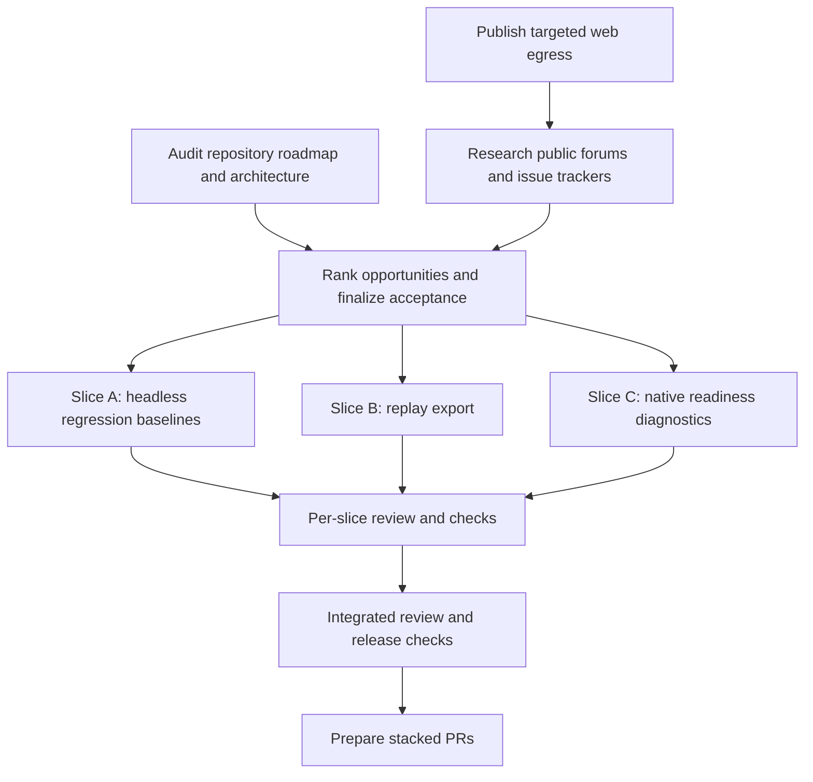

# OpenController AI and Gaming Opportunity Goal

**Status:** discovery in progress; external community evidence is blocked pending
environment network publication. Repository findings below are verified against
the checkout at `d6e9e86` (2026-10-04). Community demand is not yet verified.

## Product goal

Make it straightforward to connect an AI or game test agent to a controller,
understand what the host can support, and reproduce what happened when a run
fails. Improve the existing native bring-up and headless/replay workflows first;
keep privileged driver installation, game perception, and provider-specific
agent frameworks outside the first delivery.

This is a provisional goal based on the repository's stated roadmap and current
capabilities. Revisit its priority after the public source sweep is available.

## Evidence boundary

### Verified in this repository

| Observation | Source | What it supports |
| --- | --- | --- |
| Signed, installable native device flows and physical host feedback are the next milestone. | [README.md](../../README.md#L150) | Native setup is a first-party product gap. It does not establish how many users are blocked by it. |
| Native setup emits reviewed assets and commands but does not install, sign, change permissions, or activate system extensions. | [native-host-bridge.md](../native-host-bridge.md#L71) | Setup automation has a clear safety boundary. |
| The roadmap calls for stored Agent Fighter regression baselines. | [README.md](../../README.md#L864) | Headless regression work is already in project scope. |
| The roadmap calls for JSON, CSV, and training-friendly replay export. | [README.md](../../README.md#L865) | Replay export is already in project scope. |
| The CLI replay command reports a summary; replay logs already store event streams. | [replay-logs.md](../replay-logs.md#L1) | There is an existing implementation path for practical replay inspection/export. |
| Agent Fighter has a headless match-series runner and quality gates. | [agent-fighter.md](../agent-fighter.md) | Existing evaluation code can support a baseline workflow. |

### External research state

On 2026-10-04, requests to Reddit, the GitHub API, Hacker News/Algolia, and
Steam Community failed with `CONNECT tunnel failed, response 403`. No browser or
search connector is available in this task. The environment's custom egress
draft was updated to allow the targeted public-source hosts, but the draft
requires user review and publication before requests can succeed. No forum post,
issue, trend, or recurrence count is claimed in this document.

Planned source sweep after publication:

| Community | Starting point / query | Status |
| --- | --- | --- |
| Reddit gaming | [r/Steam: controller not detected](https://www.reddit.com/r/Steam/search/?q=controller%20not%20detected&restrict_sr=1) | Blocked; not reviewed |
| Reddit Linux gaming | [r/linux_gaming: Steam Input/controller](https://www.reddit.com/r/linux_gaming/search/?q=controller%20steam%20input&restrict_sr=1) | Blocked; not reviewed |
| Reddit accessibility | [r/disabledgamers: remapping](https://www.reddit.com/r/disabledgamers/search/?q=controller%20remapping&restrict_sr=1) | Blocked; not reviewed |
| Steam Community | [controller discussions](https://steamcommunity.com/discussions/forum/1/) | Blocked; not reviewed |
| GitHub | [SDL gamepad/controller issues](https://github.com/libsdl-org/SDL/issues?q=gamepad+controller) and game-agent repos | Blocked; not reviewed |
| Hacker News | [Algolia search for AI game agents](https://hn.algolia.com/?q=AI%20game%20agent) | Blocked; not reviewed |
| AI developer forum | [OpenAI developer community](https://community.openai.com/) | Blocked; not reviewed |
| Linux gaming forum | [GamingOnLinux](https://www.gamingonlinux.com/) | Blocked; not reviewed |

For each recurring signal, record a direct post/issue URL, publication date,
persona and situation, repeated independent reports, workaround, severity
indicators, counterexamples, and confidence. Search entry pages are discovery
leads, not evidence by themselves.

## Provisional opportunity backlog

Demand confidence remains **unknown** for every item until community sources are
reviewed. Current ordering reflects explicit roadmap support, code proximity,
and delivery feasibility only.

| Rank | Opportunity | Persona / current workaround | Repository evidence | Fit | Cost / risk | External demand |
| --- | --- | --- | --- | --- | --- | --- |
| 1 | Reproducible headless regression baselines | Agent authors and CI maintainers currently inspect match-series summaries or rely on broad ad-hoc thresholds. | Existing headless series and quality checks; baseline explicitly listed on roadmap. | High | Medium; stochastic runs can make baselines flaky. | Unknown |
| 2 | Replay export and practical inspection | Agent researchers and dataset maintainers currently write custom parsers for JSONL logs. | Replay logger and summary command exist; JSON/CSV/training export is on roadmap. | High | Medium; schema/versioning and large-file behavior matter. | Unknown |
| 3 | Native readiness and compatibility diagnostics | Integrators manually build helpers, inspect platform docs, and troubleshoot paths/permissions. | Linux uinput, Windows VHF, and macOS DriverKit setup/doctor packages exist; signing and installation remain user-managed. | High | Medium/high; privileged host changes are platform-sensitive. | Unknown |
| 4 | Provider-neutral game-agent integration | Agent authors build game-specific observation and provider glue. | Agent Fighter has a bespoke Responses API loop; the core SDK already constrains controller actions. | Medium/high | Medium; risks broadening the SDK into perception/provider scope. | Unknown |
| 5 | Controller ownership, reconnect, and crash recovery | Multi-agent/local testing authors write their own lifecycle coordination. | Hub, safety limits, neutral operations, and device status exist; a lease/watchdog contract is not documented. | Medium | High; process-crash and real-device semantics need careful design. | Unknown |
| 6 | Persistent accessible remapping/calibration | Accessibility users configure mapping/calibration through external host tools. | Profiles and action maps exist; no persistent calibration/remap store is documented. | Medium | High; must validate needs and platform/game boundaries. | Unknown |

## Build goal and acceptance checklist

### Slice A — headless regression baselines

- [ ] Version a baseline format with runner version, local-policy/config metadata,
  match count, and selected aggregate metrics.
- [ ] Compare measured results to checked-in baselines with explicit tolerances
  and readable metric deltas.
- [ ] Make baseline updates an explicit command; normal runs must not rewrite
  expected results.
- [ ] Keep stochastic external-model runs separate from deterministic/local
  regression gates.
- [ ] Add fixtures for passing, failing, malformed, and incompatible baselines.
- [ ] Document baseline creation and CI usage.

### Slice B — replay export

- [ ] Add streaming exports for JSON and CSV without loading the whole JSONL log.
- [ ] Define stable columns/schema for each event kind and preserve timestamps.
- [ ] Keep source event data available for training-oriented exports without
  silently dropping unknown fields.
- [ ] Reject malformed input with path and line number.
- [ ] Add fixture coverage for mixed event types, empty files, CRLF, and bad rows.
- [ ] Document supported formats and their compatibility contract.

### Slice C — native readiness diagnostics

- [ ] Provide a stable machine-readable report for runtime, selected backend,
  helper path/existence, permissions, capabilities, and actionable next steps.
- [ ] Distinguish missing helper, permission failure, early process exit, and
  protocol mismatch where the host can observe them.
- [ ] Keep diagnostics read-only by default; do not silently install drivers,
  change permissions, or bypass signing/trust.
- [ ] Add platform-shaped fixtures and document what cannot be validated on the
  current OS.
- [ ] Treat signed installers as a separate, platform-specific follow-up that
  requires signing assets and a security/release review.

### Discovery and integration

- [ ] Publish the environment egress draft, then retry the source sweep.
- [ ] Replace unverified hypotheses with dated, linked source evidence and
  confidence notes; reprioritize or remove unsupported items.
- [x] Audit repository roadmap, existing implementations, and boundaries.
- [x] Save targeted research domains in the environment configuration draft.
- [ ] Review every slice independently, run its targeted tests/build/docs checks,
  and then run the integrated release checks.
- [ ] Create small, meaningful commits and stacked PRs; do not merge without
  explicit authorization.

## Work DAG

The three implementation slices have disjoint primary ownership and can run in
parallel after the goal/acceptance commit. Their PRs depend on that base and can
be reviewed independently. Reprioritization after external research may change
the DAG; do not merge any branch as part of this task.

## Branch and swarm operating rules

- Each implementation agent owns one named branch and worktree; do not edit the
  same package or roadmap checklist from multiple worktrees.
- Fetch `origin` before starting, at integration checkpoints, and before final
  validation. Rebase only onto the declared parent branch and resolve conflicts
  immediately.
- Commit each coherent, reviewable step; do not split commits artificially.
- PR description records the user problem, source evidence state, acceptance
  criteria, dependency/base branch, and exact validation results.
- The source-research DAG node remains open until egress is published and actual
  forum sources have been reviewed.
