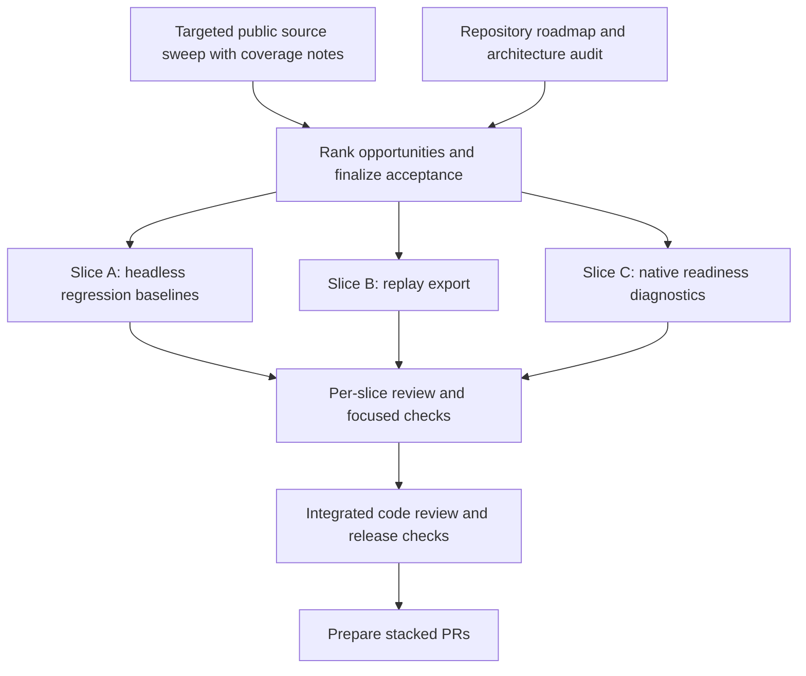

# OpenController AI and Gaming Opportunity Goal

**Status:** targeted community sweep completed with documented coverage gaps; three implementation branches are in progress. External evidence was checked on 2026-10-04. Integrated review remains pending.

## Product goal

Make OpenController dependable when a game or agent needs an OS-visible controller: explain what the host can support, make input failures diagnosable, and let teams reproduce and compare runs. Prioritize native-device readiness and repeatable headless/replay workflows. Keep driver installation, game perception, and game-specific high-level APIs outside the SDK's first delivery.

The goal is grounded in both the repository roadmap and a targeted public-source sweep. The evidence supports concrete compatibility and evaluation friction; it does not establish market-wide prevalence.

## Evidence boundary

### Verified in this repository

| Observation | Source | What it supports |
| --- | --- | --- |
| Signed, installable native device flows and physical host feedback are the next milestone. | [README.md](../../README.md#L150) | Native setup is a first-party product gap. It does not establish how many users are blocked by it. |
| Native setup emits reviewed assets and commands but does not install, sign, change permissions, or activate system extensions. | [native-host-bridge.md](../native-host-bridge.md#L71) | Setup automation has a clear safety boundary. |
| The roadmap calls for stored Agent Fighter regression baselines. | [README.md](../../README.md#L864) | Headless regression work is already in project scope. |
| The roadmap calls for JSON, CSV, and training-friendly replay export. | [README.md](../../README.md#L865) | Replay export is already in project scope. |
| The CLI replay command reports a summary; replay logs already store event streams. | [replay-logs.md](../replay-logs.md#L1) | There is an existing implementation path for practical replay inspection/export. |
| Agent Fighter has a headless match-series runner and quality gates. | [agent-fighter.md](../agent-fighter.md) | Existing evaluation code can support a baseline workflow. |

### External research state

The targeted sweep ran on 2026-10-04 across SDL and Steam for Linux GitHub issues, Steam Community discussions, Factorio Learning Environment reports, Hacker News, and the OpenAI developer forum. It found repeated examples of device-specific mapping/initialization failures, host permission or virtual-device lifecycle friction, and hard-to-reproduce agent-evaluation errors. Treat these as recurring categories in the reviewed sources, not prevalence estimates.

Coverage is incomplete. Reddit endpoints return an HTTP 403 network-security page, so no Reddit posts were reviewed. GamingOnLinux search returned the homepage without results; its latest RSS feed had no relevant controller/gamepad/Steam Input items. Search results were targeted samples, not an exhaustive read of every forum, repository, or historical thread. Thread replies/reactions measure attention to that report, not affected-user counts.

#### Source log

| Source and date | Direct evidence | Observed pain and evidence limits |
| --- | --- | --- |
| SDL issue #16441, 2026-10-04 | [8BitDo Ultimate 2C rejected over Bluetooth](https://github.com/libsdl-org/SDL/issues/16441), 0 comments when checked | A Bluetooth PID not recognized by SDL's 8BitDo driver prevents this device mode from initializing. Specific hardware report; no recurrence shown in the thread. |
| SDL issue #16434, 2026-10-03 | [GameSir T3s calibration reply length](https://github.com/libsdl-org/SDL/issues/16434), 0 comments | Switch-mode controller is detected on Linux but fails HIDAPI initialization because the calibration reply has a different length. Specific device/protocol case. |
| SDL issue #16400, 2026-09-28 | [Steam Controller remains in lizard mode](https://github.com/libsdl-org/SDL/issues/16400), 0 comments | Keyboard/mouse fallback and gamepad events conflict. A new, single report. |
| SDL issue #16237, 2026-09-03 | [Betop motion data is NaN in SDL3](https://github.com/libsdl-org/SDL/issues/16237), 4 comments | Buttons/rumble work while gyro/accelerometer data is unusable; reporter compares SDL2 and SDL3. |
| SDL issue #15658, 2026-05-20 | [8BitDo triggers lack analog input](https://github.com/libsdl-org/SDL/issues/15658), 7 comments | SDL/Steam expose non-analog triggers where a browser gamepad tester reports values. Shows API/backend differences for a particular controller, not all devices. |
| Steam for Linux issue #10442, 2024-01-28 | [Wayland asks to allow remote interaction](https://github.com/ValveSoftware/steam-for-linux/issues/10442), 130 comments, 118 reactions | Fedora/GNOME Wayland consent blocks using an Xbox controller as a mouse. High-engagement thread; engagement is not a rate estimate. |
| Steam for Linux issue #13665, 2026-09-29 | [Game Mode recreation silently drops controller input](https://github.com/ValveSoftware/steam-for-linux/issues/13665), 0 comments | Launching an app can recreate Steam Input's virtual gamepad and leave other running apps without input. Recent singleton report. |
| Steam for Linux issue #13029, 2026-03-23 | [ASUS HID events reset the Steam virtual gamepad](https://github.com/ValveSoftware/steam-for-linux/issues/13029), 4 comments | Reporter observes input reset across several games after an unrelated device event; one reporter, several affected titles. |
| Steam Deck discussion, 2026-08-04 | [GameSir G7 Pro rumble missing on SteamOS](https://steamcommunity.com/app/1675200/discussions/1/580552797772062608/), 2 replies | Dongle input works but rumble is lost; author and one commenter report the same symptom. |
| Steam Deck discussion, 2026-09-26 | [Controller order breaks while docked](https://steamcommunity.com/app/1675200/discussions/1/806848045381749056/), 10 replies | Docked Legion Go S with two Xbox pads reports unusable controller ordering; replies add context. One thread, not prevalence data. |
| Steam Deck feature request, 2026-09-30 | [Expose Steam Deck as a Bluetooth controller](https://steamcommunity.com/app/1675200/discussions/2/585061535403037013/), 0 replies | One request for a virtual-controller mode. Low-confidence demand signal. |
| Factorio Learning Environment issue #417, 2026-09-14 | [Client-join blockers and misleading errors](https://github.com/JackHopkins/factorio-learning-environment/issues/417), 1 comment | Agent-evaluation user reports dependency and client-join failures, swallowed errors, and camera/event-handler problems; local patches were the workaround. Strong report detail, one environment. |
| Factorio Learning Environment issue #418, 2026-09-15 | [Agent-facing examples do not run](https://github.com/JackHopkins/factorio-learning-environment/issues/418), 0 comments | Several documented examples fail against a live headless server. Single project report; supports clear, executable action docs, not controller transport specifically. |
| Factorio Learning Environment PR #413, 2026-09-07 | [Retry and error handling for transient observations](https://github.com/JackHopkins/factorio-learning-environment/pull/413), 0 comments | A long evaluation rollout failed on a transient observation error; the underlying cause was hidden and healthy epochs were cancelled. Same action sequence later replayed successfully; retries and surfaced errors were the fix. This is a merged fix PR, not an open request. |
| OpenAI developer forum, 2026-02-16 | [2D game built with Codex and agent skills](https://community.openai.com/t/show-2d-game-built-using-codex-and-agent-skills-zero-code/1374319), 7 replies | A player could not move with arrows because only WASD was mapped; author added arrow/space mappings. Concrete action-map friction, but a human-player demo rather than an SDK user report. |
| OpenAI developer forum, 2026-09-29 | [Autonomous assistant for PC gamers](https://community.openai.com/t/autonomous-agent-assistant-for-pc-gamers/1402066), 1 reply | One gamer says manual state descriptions and screenshots are cumbersome and asks about temporary controller takeover. Perception/memory interest is outside this SDK's current scope. |
| Hacker News, 2025-03-11 | [Factorio Learning Environment launch](https://news.ycombinator.com/item?id=43331582), 749 points, 209 comments | Strong interest in game-agent benchmarking and long-horizon automation. A launch discussion, not a pain-point survey; the environment exposes high-level game actions rather than a virtual gamepad. |
| Hacker News, 2026-09-11 | [Clawfight agentic game](https://news.ycombinator.com/item?id=49658483), 13 points, 17 comments | Creator says Unreal-based remote control quality was not good enough and describes a near-real-time video approach. The reported quality issue is ambiguous, so fit to controller transport is low. |

#### Cross-source interpretation

| Candidate theme | Evidence and confidence | Product interpretation |
| --- | --- | --- |
| Host permissions, controller identity/mapping, and virtual-device lifecycle | Several distinct SDL and Steam reports across 2024-2026, plus Steam Deck reports. **Moderate confidence** that this is a recurring integration category; prevalence and the fraction OpenController can fix are unknown. | Prioritize clear host/helper readiness output and follow with a compatibility test matrix. SDL or Steam-owned mapping bugs must be fixed upstream. |
| Reproducing failed agent runs and making errors actionable | Three adjacent FLE evaluation reports discuss setup, transient observation failures, hidden errors, and replaying the same sequence. **Moderate confidence** in the workflow friction; one benchmark ecosystem, medium project fit. | Replay export and deterministic baselines are direct, bounded improvements to existing OpenController capabilities. They do not reproduce screenshots or game state the SDK never recorded. |
| Consistent action mapping and broader game control | SDL has device-specific mapping reports; one OpenAI forum game demo needed arrow-key support. **Low-to-moderate confidence**; several examples but different users and layers. | Document normalized action maps and test consumer-visible profiles. Do not claim a universal mapping can repair every title. |
| Screen understanding, memory, and high-level game APIs | One gamer requested these; high-engagement HN game-agent launches use game-domain APIs. Evidence is mixed and mostly adjacent. | Keep perception, model planning, and game-specific integrations optional or out of scope. Many agent environments do not need a controller emulator. |

For each future signal, keep the direct post/issue URL, date, persona and situation, workaround, recurrence indicators, counterexamples, and confidence. Search/result pages alone are not evidence.

## Prioritized opportunity backlog

Rank balances user value, evidence strength, fit to this SDK, implementation cost, and platform/security risk. Evidence confidence is about the reviewed sources, not the size of the market.

| Rank | Opportunity | User and current workaround | Evidence and confidence | Project fit | Cost / risk | Decision |
| --- | --- | --- | --- | --- | --- | --- |
| 1 | Native readiness and visible failure diagnosis | Game/agent developers whose host fails to create or retain an OS-visible gamepad currently piece together OS, Steam Input, and helper logs. | SDL and Steam reports show multiple host/device initialization and lifecycle cases, including [Wayland consent](https://github.com/ValveSoftware/steam-for-linux/issues/10442) and [Steam Input device recreation](https://github.com/ValveSoftware/steam-for-linux/issues/13665). **Moderate** category confidence; OpenController cannot fix upstream driver bugs. | High: native bridge and doctor already exist. | Medium; host-specific semantics and privilege boundaries require care. | Implement read-only readiness reporting now; device-specific game-consumption proof is deferred. |
| 2 | Reproducible headless evaluation and replay | Agent authors/CI maintainers debugging a failed or regressed match currently inspect summaries or build bespoke parsers. | [FLE transient rollout failure](https://github.com/JackHopkins/factorio-learning-environment/pull/413), [setup/error report](https://github.com/JackHopkins/factorio-learning-environment/issues/417), and [high HN interest in FLE](https://news.ycombinator.com/item?id=43331582). **Moderate** workflow confidence from one benchmark ecosystem; source logs cannot restore unrecorded game state. | High: existing headless runner, event logs, and explicit roadmap items. | Medium; deterministic timing, schema stability, and large files matter. | Implement local-policy baselines and streaming JSON/CSV export. |
| 3 | Cross-consumer controller compatibility matrix | Integrators compare whether a device/profile reaches Steam, SDL, and a native game with expected axes, rumble, and motion; today they swap modes and test each consumer manually. | SDL has several device-specific reports; Steam Deck discussions include [missing rumble](https://steamcommunity.com/app/1675200/discussions/1/580552797772062608/) and [broken controller ordering](https://steamcommunity.com/app/1675200/discussions/1/806848045381749056/). **Moderate** category confidence, but many underlying fixes belong upstream. | Medium/high: SDK profiles and native output are testable. | Medium/high; needs representative hardware/OS coverage and should not encode one game's assumptions as universal. | Next follow-up: publish a manual test matrix and add virtual-profile conformance fixtures. |
| 4 | Reconnect, sleep/resume, and input-loss recovery | Desktop/streaming users whose virtual device is recreated or dropped currently restart the app or reconnect devices. | Recent [Steam Game Mode report](https://github.com/ValveSoftware/steam-for-linux/issues/13665) and [uinput reset report](https://github.com/ValveSoftware/steam-for-linux/issues/13029), plus [Sunshine's ViGEm transition](https://github.com/LizardByte/Sunshine/issues/3527). **Low-to-moderate** confidence: few threads and mostly upstream-specific. | Medium: bridge lifecycle/status exists. | High; must define idempotency, ownership, crash behavior, and safe neutral state. | Defer API changes; first expose lifecycle signals and validate real host semantics. |
| 5 | Persistent accessible remapping and calibration | Players with varied motor needs currently depend on game, Steam Input, or separate host remapping tools. | One [OpenAI forum demo needed arrow-key mappings](https://community.openai.com/t/show-2d-game-built-using-codex-and-agent-skills-zero-code/1374319); the Reddit accessibility sweep was blocked. **Low** confidence; target community coverage is missing. | Medium: action maps exist. | Medium/high; needs accessibility research and persistence semantics. | Defer pending direct research with disabled gamers and accessibility-focused communities. |
| 6 | Game perception, memory, and provider-neutral gameplay APIs | PC gamers manually share screenshots/state, while agent benchmark authors often use direct game APIs. | One [forum request for screen understanding](https://community.openai.com/t/autonomous-agent-assistant-for-pc-gamers/1402066) contrasts with the high-level API model in FLE and [MCP-first Clawfight](https://news.ycombinator.com/item?id=49658483). **Low/mixed** fit evidence. | Low/medium: adjacent to controller output, not core transport. | High; expands into vision, model orchestration, and game-specific APIs. | Keep outside the SDK core; revisit only for an optional example/integration backed by stronger demand. |

## Build goal and acceptance checklist

### Slice A — headless regression baselines

- [ ] Version baseline metadata for the deterministic local policy, simulation
  mode/timestep, Bun/browser versions, run configuration, and active metrics.
- [ ] Compare configuration fields individually and show expected values,
  observed values, deltas, and explicit tolerances.
- [ ] Make baseline updates explicit; normal runs must never rewrite expected data.
- [ ] Keep external-model runs out of deterministic regression gates.
- [ ] Pin meaningful nonzero action/damage activity metrics. Do not pin round or
  winner metrics until the runner measures them consistently.
- [ ] Cover pass, fail, malformed, incompatible metadata, and repeated identical
  comparison runs.
- [ ] Document baseline creation, comparison, and the metrics deliberately omitted.

### Slice B — replay export

- [x] Stream JSON arrays and CSV from JSONL without retaining the whole log.
- [x] Keep stable CSV columns, timestamps, and original event JSON so unknown
  fields survive export.
- [x] Report malformed input with the source path and one-based line number.
- [x] Cover mixed events, empty and CRLF logs, quoting, malformed rows, and
  destination aliases that could truncate the input.
- [x] Document supported formats and the preservation contract.

### Slice C — native readiness diagnostics

- [ ] Provide a versioned machine-readable report with timestamp, host/runtime,
  backend support, helper path/status/executable state, requirements,
  capabilities, and actionable next steps.
- [ ] Distinguish absent from unavailable helpers and only call a helper
  available when the path is a usable regular file.
- [ ] Represent unsupported-host checks as unknown or not applicable, without
  host-specific signing, elevation, or install instructions for another OS.
- [ ] Keep diagnostics read-only; never claim to prove a driver is activated or
  a game/Steam will consume that virtual device when it was not tested.
- [ ] Add OS-shaped tests and document what cannot be validated on this host.
- [ ] Treat signed installers as a separate platform-specific follow-up needing
  signing assets and release/security review.

### Discovery and integration

- [x] Audit repository roadmap, existing implementations, and safety boundaries.
- [x] Search selected public AI/gaming sources and record dated links, engagement, workarounds, confidence, and coverage gaps.
- [x] Re-rank the backlog from observed reports, project fit, cost, and risk; defer weakly supported or upstream-owned work.
- [ ] Revisit accessibility and Reddit-specific pain points if those communities become reachable; current feature slices do not depend on this gap.
- [ ] Review each slice, run targeted checks, and then run integrated release checks.
- [ ] Prepare small, meaningful stacked PRs with evidence, dependency order, acceptance criteria, and exact validation; do not merge without explicit authorization.

## Work DAG

The targeted source-sweep node is complete for the sources listed above; Reddit and accessibility-focused community evidence remain explicit gaps. The three implementation slices have disjoint package ownership and can proceed in parallel after the goal commit. Their branches share this goal as a parent; none is to be merged during implementation.

## Branch and swarm operating rules

- Each implementation agent owns one named branch and worktree; do not edit the
  same package or roadmap checklist from multiple worktrees.
- Fetch `origin` before starting, at integration checkpoints, and before final
  validation. Rebase only onto the declared parent branch and resolve conflicts
  immediately.
- Commit each coherent, reviewable step; do not split commits artificially.
- PR description records the user problem, source evidence state, acceptance
  criteria, dependency/base branch, and exact validation results.
- Keep the Reddit and accessibility research gaps visible; refresh the source
  sweep before making prevalence claims or starting deferred accessibility work.
